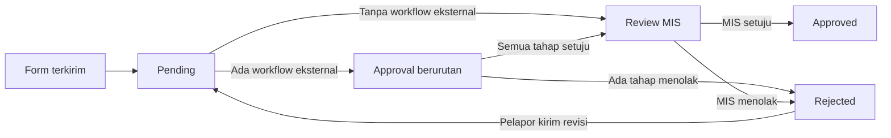

# Waste / adjustment

Laporan waste outlet tanpa login. Satu laporan milik satu brand dan satu outlet. Isinya identitas pelapor plus satu atau lebih kejadian. Tiap kejadian punya barang, jumlah, kategori, dan 1–5 foto kamera. Alasan wajib untuk JCHICKEN dan LUUCA. Section tersedia pada JCHICKEN. Field nama PIP/referensi tersedia pada MOMOYO.

Setiap pengiriman dari form publik masuk `pending`. Jika ada workflow approval eksternal, approver memeriksa secara berurutan. Sesudah semua tahap eksternal selesai, atau jika tidak ada workflow eksternal, pengelola brand memeriksa laporan sebagai MIS di panel admin. Hanya keputusan MIS yang membuat laporan `approved` dan masuk ekspor bulanan. Workflow yang aktif tetapi tidak lengkap harus diperbaiki sebelum pengiriman dapat diproses.

## Objek bisnis

| Objek | Arti | Unik berdasarkan |
| --- | --- | --- |
| Brand | JCHICKEN, LUUCA, MOMOYO, atau brand baru | `code` |
| Outlet | Cabang di dalam brand | `code` dan `slug` per brand |
| Item | Barang yang boleh dipilih | `code` per brand. Harus aktif dan punya satuan |
| Satuan | Pilihan satuan terpusat untuk master barang | `code` |
| Kategori | Jenis adjustment, misalnya Waste atau Spoil | `code` per brand, tabel `waste_categories` |
| Section | Bagian outlet, misalnya BAR atau COOK | `code` per brand, tabel `waste_sections` |
| Workflow | Daftar approver | Satu workflow aktif per outlet, atau satu workflow brand (`outlet_id` kosong) sebagai cadangan |
| Laporan | Satu pengiriman | `uid`. Revisi menambah versi, tidak menimpa versi lama |

Section dan kategori sama-sama baris database milik brand. Jawaban yang dipilih tersimpan langsung di kejadian laporan: `section` sebagai nama, `category_id` plus salinan `category_name`. JCHICKEN punya BAR, COOK, ASSEMBLY, MP, DINING. LUUCA dan MOMOYO tidak punya baris section, jadi dropdown section tidak muncul.

MOMOYO dapat memilih item aktif sebagai nama PIP atau referensi, termasuk item yang jenisnya bukan `PIP`, sesuai contoh Excel. Untuk brand lain, referensi hanya tersedia jika ada item aktif dengan `item_type` `PIP`. Jenis barang disalin dari master saat kejadian disimpan untuk menjaga nilai ekspor ketika master berubah.

## Sumber Excel

File master diatur lewat `WASTE_MASTER_JCHICKEN`, `WASTE_MASTER_LUUCA`, dan `WASTE_MASTER_MOMOYO`. Import hanya membaca sheet master barang, bukan sheet form bulanan.

| Brand | Sheet | Baris mulai | Kolom yang dipakai |
| --- | --- | --- | --- |
| JCHICKEN | `Master data` | 2 | A nama, B kode, C satuan, F jenis |
| LUUCA | `MASTER DATA` | 2 | A nama, B kode, D satuan, E jenis |
| MOMOYO | `Master data` | 3 | A nama, B kode, C satuan, D jenis (`PIP` atau bahan baku) |

Baris tanpa nama atau kode, baris `NON PIP`, satuan kosong, atau nama berisi `SALAH` tidak menjadi pilihan form. Satuan kosong dan `SALAH` tetap tersimpan sebagai item nonaktif.

Sheet form bulanan adalah acuan isian, bukan sumber import transaksi. Kode dan jenis mengikuti barang yang dipilih. Satuan utama mengikuti master barang; jika satuan di Excel berbeda, admin harus meninjau kandidat pasangan barang–satuan satu per satu pada menu **Kandidat satuan** sebelum pilihan tersebut muncul di form. Jumlah tetap disimpan dalam satuan yang dipilih, tanpa konversi otomatis. User adalah nama pelapor. WhatsApp dan email dipakai untuk notifikasi.

Kandidat JCHICKEN September ditampung dengan `php artisan waste:stage-alternate-units "/path/to/Waste Form Adjustment Jchicken Ciledug .xlsx" --sheet="SEPTEMBER 26"`. Perintah ini menyimpan 11 pasangan dari 20 baris yang berbeda dari satuan utama, berikut jumlah baris dan contoh sel sumber; hasil `ML:` dinormalisasi menjadi `ML`. Semua kandidat baru berstatus menunggu dan tidak mengaktifkan satuan. Mengulang perintah memperbarui rujukan sumber tanpa membatalkan keputusan admin. Admin dapat menyetujui, menolak dengan alasan, atau membuka ulang keputusan pada menu **Kandidat satuan**.

Header form yang dipakai outlet (bukan sheet master):

| Brand | Contoh sheet | Satu baris Excel artinya | Kolom yang diisi orang |
| --- | --- | --- | --- |
| JCHICKEN | `SEPTEMBER 26` | Satu produk | Tanggal, nama produk, jumlah, satuan yang disetujui, alasan, user, section, kategori. Kode dan jenis terisi dari master |
| LUUCA | `SEPTEMBER 26` | Satu produk | Sama dengan JCHICKEN, tanpa section |
| MOMOYO | `SEPTEMBER` | Satu bahan, boleh menempel ke satu PIP | Tanggal, nama PIP, nama barang, qty PIP, qty barang, keterangan. Kode dan satuan terisi dari master |

Kategori JCHICKEN dan LUUCA di sheet itu `Waste` atau `Spoil`. Keterangan MOMOYO berperan sebagai kategori: `Waste`, `Spoil`, atau `Training/Trial`. MOMOYO tidak punya kolom alasan bebas dan tidak punya section. Nilai `NON PIP` di kolom nama PIP artinya barang dicatat langsung, bukan bahan dari produk PIP.

## Form publik

URL: `/waste/{brand}/{outlet}`. Brand dicocokkan ke `code` atau nama. Outlet dicocokkan ke `code` atau `slug`. Keduanya harus aktif.

Dua halaman, tetap dua meskipun ada lebih dari satu kejadian.

1. **Data pelapor.** Tanggal kejadian, nama, WhatsApp, email opsional. Nama, WhatsApp, dan email disimpan di `localStorage` dengan kunci `cesa.waste.reporter` supaya kunjungan berikutnya terisi lagi. Tanggal dan isi kejadian tidak disimpan. Halaman revisi tidak menimpa data yang sudah ada dengan nilai browser.
2. **Barang & foto.** Satu halaman yang sama untuk semua brand. Pilihan barang dan satuan berasal dari master brand; field yang tidak relevan disembunyikan dari data brand.

Halaman ini selalu menampilkan, untuk tiap kejadian:

1. Barang, jumlah, dan satuan. **Tambah barang** menambah baris di kejadian yang sama. Satuan alternatif hanya dapat dipilih setelah disetujui admin untuk barang tersebut.
2. Alasan, teks bebas, wajib untuk JCHICKEN dan LUUCA.
3. Kategori, wajib.
4. Foto kamera.

Dua field tambahan muncul hanya kalau brand-nya punya datanya:

| Field | Muncul ketika | Brand sekarang |
| --- | --- | --- |
| Section | Brand punya baris aktif di `waste_sections` | JCHICKEN, di samping kategori |
| Barang PIP/referensi dan jumlahnya | MOMOYO punya item aktif, atau brand lain punya item aktif berjenis `PIP` | MOMOYO, di bawah kategori |

**Tambah kejadian** menambah blok yang sama di halaman ini. Jumlah halaman tetap dua.

### JCHICKEN

```text
Barang + jumlah
Alasan
Section | Kategori
Foto
```

Section pilihan dari tabel `waste_sections`: `BAR`, `COOK`, `ASSEMBLY`, `MP`, `DINING`. Boleh dikosongkan. Jenis barang (`bahan baku`, `barang jadi`) tersimpan dari master, tidak ada input sendiri. Tidak ada barang PIP pada master JCHICKEN saat ini.

### LUUCA

```text
Barang + jumlah
Alasan
Kategori
Foto
```

Tidak ada section dan tidak ada barang PIP pada master saat ini. Jenis di master (`BAHAN BAKU LUUCA`) ikut diimpor untuk ekspor, tanpa menambah field di form.

### MOMOYO

```text
Barang + jumlah          <- bahan yang terbuang
Kategori                 <- padanan kolom Keterangan di Excel
Barang PIP | Jumlah PIP  <- opsional
Foto
```

Dua cara mengisi satu kejadian:

- **Tanpa PIP.** Kosongkan barang PIP. Baris barang dicatat langsung. Ini padanan baris Excel yang nama PIP-nya `NON PIP`.
- **Dengan PIP/referensi.** Pilih nama PIP atau item referensi (misalnya Black Tea PIP atau Oolong Tea) dan isi jumlahnya. Jika referensinya berjenis `PIP`, barang di atasnya harus bahan turunannya (misalnya Black Tea), bukan PIP lain. Satu referensi bisa punya beberapa bahan lewat **Tambah barang**.

MOMOYO tidak perlu mengisi alasan tambahan. Keterangan Excel dipilih sebagai kategori dan disimpan sebagai alasan internal untuk menjaga catatan kejadian tetap lengkap.

Dropdown dengan lebih dari lima pilihan memakai pencarian. Section dan kategori JCHICKEN saat ini tetap dropdown biasa.

Foto hanya dari kamera, bukan galeri. Minimal satu, maksimal lima per kejadian. Revisi boleh tidak mengunggah foto baru; foto versi sebelumnya disalin.

## Status



Workflow yang dipakai: workflow aktif khusus outlet itu. Kalau tidak ada, workflow aktif level brand. Snapshot disimpan di versi laporan, jadi perubahan workflow admin tidak mengubah laporan yang sudah terkirim.

Langkah eksternal pertama berstatus `pending` dan mendapat tautan approval. Langkah berikutnya `waiting` dan belum punya tautan. Setelah langkah aktif disetujui, langkah `waiting` terdekat menjadi `pending` dan baru dikirimi tautan. Penolakan menghentikan sisa langkah, mengubah laporan menjadi `rejected`, dan menerbitkan tautan revisi baru. Setelah semua tahap eksternal setuju, laporan tetap `pending` sampai MIS mengambil keputusan.

MIS menandai `SM` dan `AUDIT` secara manual pada setiap baris JCHICKEN, atau `AUDIT` pada setiap baris LUUCA, sebelum menyetujui laporan. Nilai `FALSE` adalah keputusan yang sah; kosong berarti belum ditinjau. MOMOYO tidak memiliki penanda tersebut. Hanya pengelola brand yang dapat mengambil keputusan MIS. Penolakan MIS menyertakan alasan dan membuka alur revisi pelapor.

Ekspor dari daftar laporan memilih bulan, tahun, brand, dan outlet. Hanya laporan `approved` dalam bulan kalender terpilih yang masuk, lalu setiap brand dan outlet mendapat sheet bulanan dengan baris dari kejadian yang telah disetujui. Sheet `Detail` memuat jejak baris dan `Ringkasan` menggabungkan jumlah berdasarkan brand, outlet, kategori, barang, dan satuan. Laporan `pending` dan `rejected` tidak ikut ekspor ini.

Token disimpan sebagai hash. Tautan progress tetap dapat dipakai untuk melihat keputusan MIS. Tautan approval yang telah digunakan tidak berlaku lagi; revisi mengganti token progress dan revisi lama.

## Notifikasi

Antrian `whatsapp` (bisa diubah lewat `WASTE_NOTIFICATION_QUEUE`).

- Saat mengirim laporan, pelapor menerima tautan status lewat WhatsApp. Email ikut terkirim kalau `WASTE_EMAIL_NOTIFICATIONS_ENABLED` aktif dan email diisi. Penolakan dari approver eksternal dan setiap keputusan MIS memicu pemberitahuan status, termasuk saat outlet tidak memakai workflow eksternal. Penolakan MIS tanpa workflow mengarahkan pelapor ke tautan status awal untuk merevisi.
- Saat pengiriman, setiap foto bukti dikirim sebagai lampiran gambar WhatsApp tersendiri kepada pelapor dan approver eksternal yang sedang aktif. Foto diunggah dari penyimpanan privat ke WAGHub; pengiriman ulang memakai identitas lampiran dan pesan yang sama.
- Approver langkah yang sedang aktif menerima tautan approval lewat WhatsApp, dan email kalau tersedia. Approver langkah berikutnya baru menerima pesan dan foto ketika gilirannya tiba.
- Tautan revisi hanya dikirim saat laporan ditolak.

## Menambah brand atau outlet

1. Buat brand aktif dengan `code` stabil. Code ini dipakai URL dan mapping import.
2. Buat outlet aktif dengan `code`, `slug`, dan timezone.
3. Siapkan Master Satuan dan impor barang: `php artisan waste:import-master --jchicken=...` atau opsi brand yang sesuai. Barang tanpa satuan tetap nonaktif sampai admin menetapkan satuan. Brand baru butuh cabang baru di `WasteMasterImportService::definition()`.
4. Jika kejadian menggunakan satuan berbeda dari satuan utama, tampung kandidat dari workbook dengan `waste:stage-alternate-units` lalu admin meninjau setiap pasangan di menu **Kandidat satuan**. Hanya persetujuan yang menautkan satuan alternatif ke barang.
5. Isi kategori aktif milik brand itu. Form publik hanya menampilkan kategori brand, bukan kategori global.
6. Tentukan bentuk halaman Barang & foto dari data, tanpa membuat form baru:
   - Bentuk LUUCA (barang, alasan, kategori, foto): cukup impor barang dan isi kategori. Jangan buat baris section dan jangan set `item_type` ke `PIP`.
   - Bentuk JCHICKEN (tambah section): isi section aktif brand itu di tabel `waste_sections`, lewat admin Sections.
   - Bentuk MOMOYO (tambah PIP): pastikan import atau data item mengisi `item_type` persis `PIP` untuk produk PIP. Contoh Excel juga memuat barang PIP di bawah referensi PIP, termasuk referensi ke barang yang sama.
7. Jika perlu approval eksternal sebelum MIS, buat workflow aktif. Isi nama approver plus WhatsApp atau email di setiap langkah. Tanpa workflow eksternal, pengiriman tetap `pending` dan menunggu MIS.
8. Berikan akses pengelola brand kepada petugas MIS agar ia dapat meninjau laporan dan menandai baris sebelum ekspor.
9. Tautan form: `/waste/{code-brand}/{slug-outlet}`.

User admin brand melihat master dan laporan brandnya. User yang hanya dipasang di outlet melihat laporan outlet itu, tanpa mengubah master brand.

## Admin

Menu admin Waste sama polanya dengan form transfer: **Laporan waste**, **Dasbor**, lalu **Pengaturan**. Pengaturan berisi brand, outlet, barang, master satuan, kandidat satuan, kategori, section, dan approval yang menentukan isi form publik.

`/admin/waste-reports` bisa membuat, mengubah, dan menghapus laporan. Tombol catat insiden untuk koreksi, bukan jalur harian outlet.

Form admin memakai dua langkah yang sama dengan form publik. Langkah pertama identitas pelapor, ditambah brand dan outlet. Langkah kedua urutannya sama: barang, jumlah, satuan, alasan, lalu section dan kategori. Section hanya muncul untuk brand yang punya daftar section. Pengelola brand dapat menandai `SM` dan `AUDIT` per barang pada form admin untuk laporan tanpa approval eksternal; laporan dengan approval eksternal memakai aksi penandaan MIS setelah seluruh approver setuju.

Simpan dari admin tidak meminta foto baru dan tidak mengirim WhatsApp. Laporan yang berasal dari form publik tetap wajib memiliki foto bukti pada setiap kejadian. Koreksi admin atas laporan yang sudah disetujui membuka versi `pending` baru sehingga MIS harus meninjau ulang sebelum hasilnya masuk ekspor. Laporan dengan approval eksternal tidak dapat diedit dari form admin; pelapor merevisi melalui tautan setelah penolakan. Status tidak diubah langsung di form admin.

## Peta kode

| Perlu diubah | File |
| --- | --- |
| Halaman form publik | `src/Livewire/PublicWasteReportForm.php`, `resources/views/livewire/public-waste-report-form.blade.php` |
| Simpan laporan dan revisi | `src/Services/WasteReportService.php` |
| Pilih workflow | `src/Services/WasteWorkflowService.php` |
| Approval eksternal | `src/Services/WasteApprovalService.php` |
| Review MIS | `src/Services/WasteMisReviewService.php` |
| Ekspor bulanan | `src/Exports/WasteReportExport.php`, `src/Exports/WasteTemplateSheet.php` |
| Import Excel | `src/Services/WasteMasterImportService.php` |
| Siapa boleh melihat apa | `src/Services/WasteAccessService.php` |
| URL publik | `routes/web.php` |
| Admin Filament | `src/Filament/Resources/` |

Tes perilaku publik ada di `tests/Feature/WastePublicPagesTest.php`. Tes import, approval, dan revisi ada di `tests/Feature/WasteReportingTest.php`.
